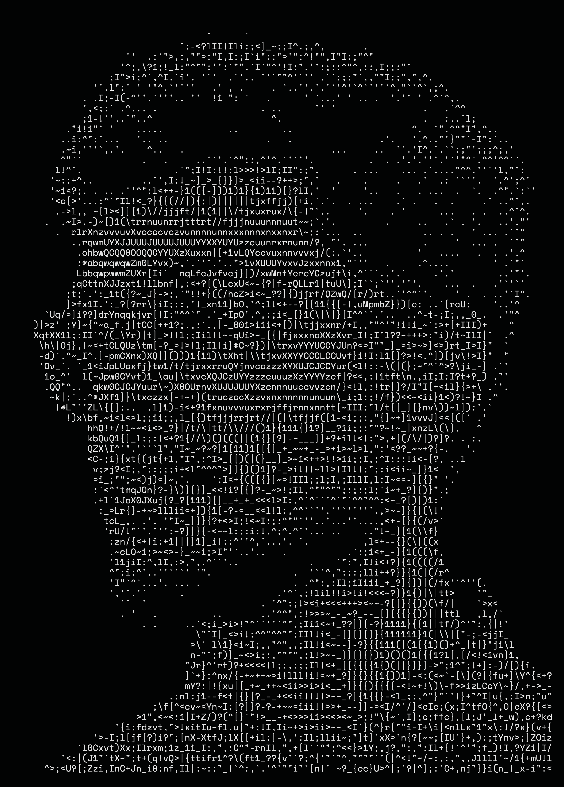

##  System Information

<table>
<tr>

<td width="42%" valign="top" align="center">



</td>

<td width="58%" valign="top">

<pre>
trishik@localhost ───────────────────────────────────────────────────────

• OS:............................... macOS, Linux
• Uptime:........................... Building Since 2006 🚀
• Host:............................. BuildZy Commerce Pvt. Ltd.
• Kernel:........................... Apple Silicon (M4)
• IDE:.............................. VS Code, Android Studio

• Languages.Programming: ........... TypeScript, Java, Python, C++, Dart
• Languages.Web: ................... React, Next.js, HTML, CSS
• Languages.Database: .............. MongoDB, Firebase, Supabase
• Languages.Real: .................. English, Hindi, Bengali

• Hobbies.Software: ................ Full Stack Development, AI, UI/UX
• Hobbies.Hardware: ................ Badminton, Chess, OverClocking

─ Contact ────────────────────────────────────────────────────────────────

• Email.Personal: .................. trishiksarkar1508@gmail.com
• LinkedIn: ........................ linkedin.com/in/trishik-sarkar
> Founder • Full Stack Developer • AI Builder
</pre>

</td>

</tr>
</table>

# 💫 Hi 👋, I'm Trishik Sarkar
**Founder of BuildZy ⚡  
Building modern tech products for construction, logistics & quick commerce in India.**

**A passionate Cloud Engineer || UI/UX Designer || Frontend Developer from India**

Email Me 👉 ✉️ **trishiksarkar1508@gmail.com** For Collaboration/Project or Anything Else. 😊😊


## 💻 Tech Stack
- Frontend Development
- UI/UX Design
- AI & Automation
- Cloud & Modern Web Technologies

## 🧠 About
- 🔭 **I’m currently working on:** BuildZy
- 🌱 **I’m currently learning:** AI,ML
- 💬 **Ask me about:** Collaboration, Tech Support
- 📫 **How to reach me:** trishiksarkar1508@gmail.com
- 😄 **Pronouns:** Trishi
- ⚡ **Fun fact:** I Love Tech and Tech Love Me

## 🚧 Currently Building
- BuildZy — Construction procurement & logistics platform
- AI-powered web experiences
- Modern scalable startup systems

## ⚡ Vision
Building technology that simplifies real-world industries across India.

## 🌐 Socials:
[](https://linkedin.com/in/trishik-sarkar) [](https://x.com/trishik_sarkar) [](https://youtube.com/@Trishik1508) [](mailto:trishiksarkar1508@gmail.com) 

<!-- Snake Game Repo View -->

<div align="center">
  
</div>

## 🏆 GitHub Trophies


# 💻 Tech Stack:
                                                                     


# 📊 GitHub Stats:
<br/>
<br/>


### ✍️ Random Dev Quote


---

# 🎯 Current Focus

```diff
+ Building AI-Powered Systems
+ Advanced Frontend UI/UX Animations
+ Firebase & Cloud Integrations
+ Human-Like Chess AI Engine
+ AntiGravity Tournament Ecosystem
+ Real-Time Safety & Guardian Applications
````

---

# 🚀 Featured Projects

<table>
<tr>
<td width="50%">

### ♟️ Human-like Chess AI

AI chess engine that learns and plays with human-style decision making.

</td>

<td width="50%">

### 🛡️ AI Safety App

Smart emergency protection system with AI danger detection.

</td>
</tr>

<tr>
<td width="50%">

### 🏆 AntiGravity Tournament

Advanced esports & tournament management platform.

</td>

<td width="50%">

### 🎨 Pinkun Interio

Modern interior & construction business website & branding.

</td>
</tr>

<tr>
<td width="50%">

### 🔐 Firebase Authentication

Secure authentication systems using Firebase backend.

</td>

<td width="50%">

### 🌐 Frontend Motion UI

Modern animated responsive UI/UX web experiences.

</td>
</tr>
</table>

---

# 📈 GitHub Activity Graph

[](https://github.com/TrishikSarkar)

---

# ⚡ Developer Mindset

> “Code. Build. Improve. Repeat.”

```yaml
Name: Trishik Sarkar
Role: Developer & Designer
Focus: AI • Frontend • Cloud • Systems
Location: India
Learning: AI/ML + Advanced Systems Design
```

```
```


<!-- Proudly created with GPRM ( https://gprm.itsvg.in ) -->
